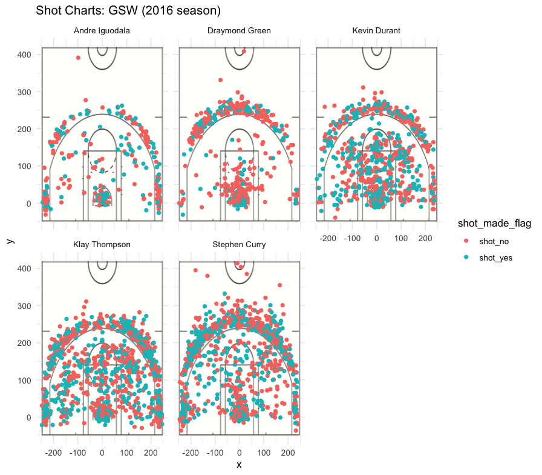

GSW Shot Charts
================

### author: Claudia Scheuter

Introduction and Background
---------------------------

Pretty much everyone living in the San Francisco Bay Area would agree with the statement that the Golden State Warriors (GSW) are an exceptionally talented, if not out of this world, team. After all, they hold several records among the top NBA teams: For example, they have performed the best ever regular season and most wins per season.\[^1\] They won the NBA championship in the seasons of 2016 - 2017 and 2014 - 2015.\[^2\] The Warriors are also among the top ten for highest valued sports franchise in the United States, with an estimated value of roughly 3.1 billion.\[^1\] But apart from these impressive facts, do the data and stats from the Warriors' games support their claim to fame and talent? Let's examine our gut feelings and check our preconceived notions!

Methods
-------

#### Data

This report used official data of the 2016 NBA season. Specifically, we were looking at the location where the player attempted the shot, the number of points (whether it was a 2 point or a 3 point field goal), and success rate. Mapping the location of the player to the coordinates of the basketball court allows us to visualize the so called "Shot Charts" of each player. The five GSW players selected for in-depth analysis were Andre Iguodala, Draymond Green, Kevin Durant, Klay Thompson, and Stephen Curry. We then further analyzed the performance of each player by tabulating the total number of shots, the number of successful shots, and the resulting percentage of successful shots (number of successful shots divided by total number of shots).

All analyses were performed using the statistical software R (version 3.5.1), visualizations were carried out with R's package ggplot2.

Results
-------

##### Preliminary Analysis: Shot charts of selected GSW players

Figure 1 shows the shot charts of 5 selected GSW players during the NBA regular season of 2016 to give us a preliminary and simple overview. Every dot represents one attempted shot, with red dots indicating no success, and green dots indicating a successful shot, mapped against the background of a standard NBA basketball court.
Players that attempted many shots (like Stephen Curry and Klay Thompson) have more blurred shot charts than those attempting fewer shots (Andre Iguodala, for example). Still, some patterns emerge: Iguodala is much more successful within the 2-point zone compared to the 3-point zone, whereas, Thompson and Curry seem better behind the 3-point circle.



Figure 1: GSW shot charts of Andre Iguodala, Draymond Green, Kevin Durant, Klay Thompson, and Stephen Curry.

Let's look closer at actual percentages of successful shots to quantify our first visual impressions!

### Quantitative Analysis: Effective Shooting Percentage

###### 2PT Effective Shooting % by Player

Table 1 (below) lists the total 2-point field goals, the number of shots made, and the percentage of successful shots from the 2-point field. The values are sorted by percentages in descending order.  In this variable of efficacy, Andre Iguodala is first, with almonst 64% success rate in the 2-point field.

``` r
two_PT <- summarise(
  group_by(shots_data, name),
  total_twoPT = sum(shot_type == "2PT Field Goal"),
  made_twoPT = sum(shot_made_flag == "shot_yes" & shot_type == "2PT Field Goal"),
  percent_twoPT = (made_twoPT/total_twoPT*100))
two_PT <- arrange(two_PT, desc(percent_twoPT))
two_PT
```

    ## # A tibble: 5 x 4
    ##   name           total_twoPT made_twoPT percent_twoPT
    ##   <chr>                <int>      <int>         <dbl>
    ## 1 Andre Iguodala         210        134          63.8
    ## 2 Kevin Durant           643        390          60.7
    ## 3 Stephen Curry          563        304          54.0
    ## 4 Klay Thompson          640        329          51.4
    ## 5 Draymond Green         346        171          49.4

###### 3PT Effective Shooting % by Player

Table 2 (below) shows the total number of 3-point field goals, the number of successful shots, and the percentage of successful shots, by player. Players are listed in descending order.  Here, Klay Thompson and Stephen Curry are the most successful players with success in &gt;40% of all attempted shots.

``` r
three_PT <- summarise(
  group_by(shots_data, name),
  total_threePT = sum(shot_type == "3PT Field Goal"),
  made_threePT = sum(shot_type == "3PT Field Goal" & shot_made_flag == "shot_yes"),
  percent_threePT = (made_threePT/total_threePT*100))
three_PT <- arrange(three_PT, desc(percent_threePT))
three_PT
```

    ## # A tibble: 5 x 4
    ##   name           total_threePT made_threePT percent_threePT
    ##   <chr>                  <int>        <int>           <dbl>
    ## 1 Klay Thompson            580          246            42.4
    ## 2 Stephen Curry            687          280            40.8
    ## 3 Kevin Durant             272          105            38.6
    ## 4 Andre Iguodala           161           58            36.0
    ## 5 Draymond Green           232           74            31.9

###### Overall Effective Shooting % by Player

Table 3 (below) lists the total shots, the successful shots and the overall success rate. Using this measure of efficacy, Kevin Durant is ahead of the game with an overall percentage of 54%, closely followed by Andre Iguodala.

``` r
overall_perc <- summarise(
  group_by(shots_data, name),
  total_shots = nrow(shots_data[name,]),
  made = sum(shot_made_flag=="shot_yes"),
  percent = (made/total_shots*100))
overall_perc <- arrange(overall_perc, desc(percent))
overall_perc
```

    ## # A tibble: 5 x 4
    ##   name           total_shots  made percent
    ##   <chr>                <int> <int>   <dbl>
    ## 1 Kevin Durant           915   495    54.1
    ## 2 Andre Iguodala         371   192    51.8
    ## 3 Klay Thompson         1220   575    47.1
    ## 4 Stephen Curry         1250   584    46.7
    ## 5 Draymond Green         578   245    42.4

Discussion
----------

This analysis showcases the different talents that make up the record-winning Golden State Warriors and make them a superior team.
In the preliminary analysis mapping the attempted successful and unsuccessful shots on the basketball court coordinates, we saw that some players are more successful behind the 3-point line vs. in the 2-point field goal zone. However, this relationship might be obscured by some players attempting many more shots than others. Players that made many shots had overlapping circles in the shot charts, which means that only visual examination of success rates may be prone to error.
In the quantitative analysis displaying the effective shooting percentages by player shows a more nuanced picture: Some players like Iguodala excel in the 2-point field goal measure, while others (like Thompson and Curry) are clearly more successful behind the 3-point line. Overall, however, the most effective player rises to be Kevin Durant, who scored an impressive 54% success rate at all attempted shots.
Overall, it seems that the players with fewer attempted shots (Durant and Iguodala) scored higher percentages of successful shots than those with more shots. This may reflect player temperament or team work dynamics, such as different positions of the players, team composition during each game, and strategic moves.
There are some limitations to this analysis that merit discussion. We restricted our analysis to the top five players among the GSW, so we cannot infer any of our findings to other GSW players or players on other teams. Secondly, given that basketball is a team sport, comparing individual players' performance on successful shots is an immense oversimplification and ignores the paramount importance of team work to achieve championships and other markers of team success.  Finally, our analysis ignored important team work dynamics during a game that might explain some of the differences documented here: the different positions of the players studied, team composition during each game, player interaction before the successful shot, or home game vs. away game, to just mention a few.

Conclusion
----------

Nonetheless, our analysis shows impressive success rates for all attempted shots from the top five GSW players. Percentages varied according to field goal type, location of the attempted shot and total number of attempted shots.

Take home message
-----------------

The five examined players showed impressive success rates for attempted shots during the 2016 season. Every player seemed to have a unique set of strenghts to display.

#### References

\[^1\] [Golden State Warriors. Wikipedia. March 11, 2019.](https://en.wikipedia.org/wiki/Golden_State_Warriors)
\[^2\] [List of NBA teams by single season win percenetage. Wikipedia. November 5, 2018.](https://en.wikipedia.org/wiki/List_of_NBA_teams_by_single_season_win_percentage)
